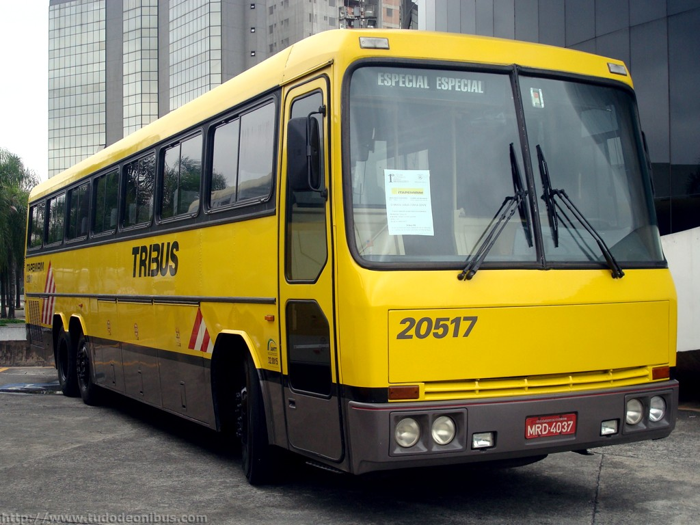
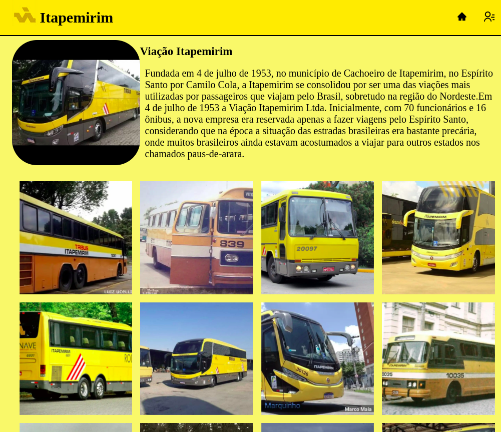
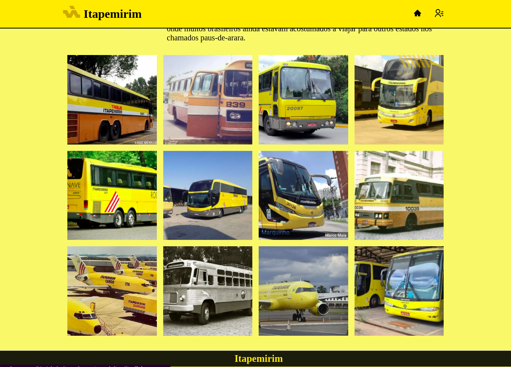
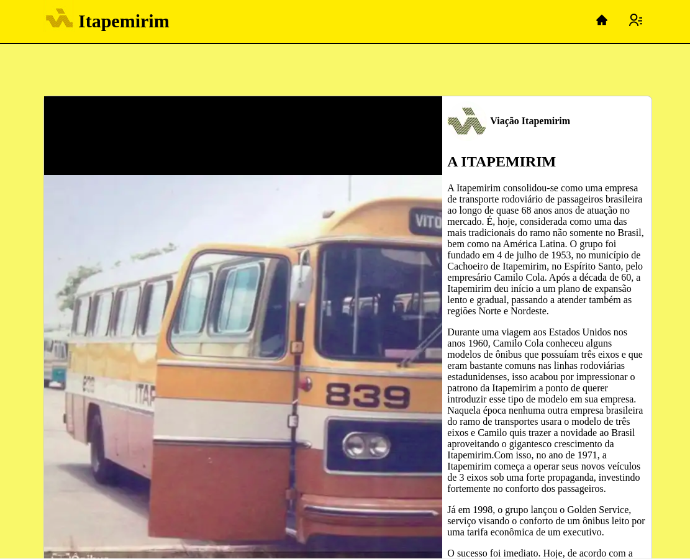
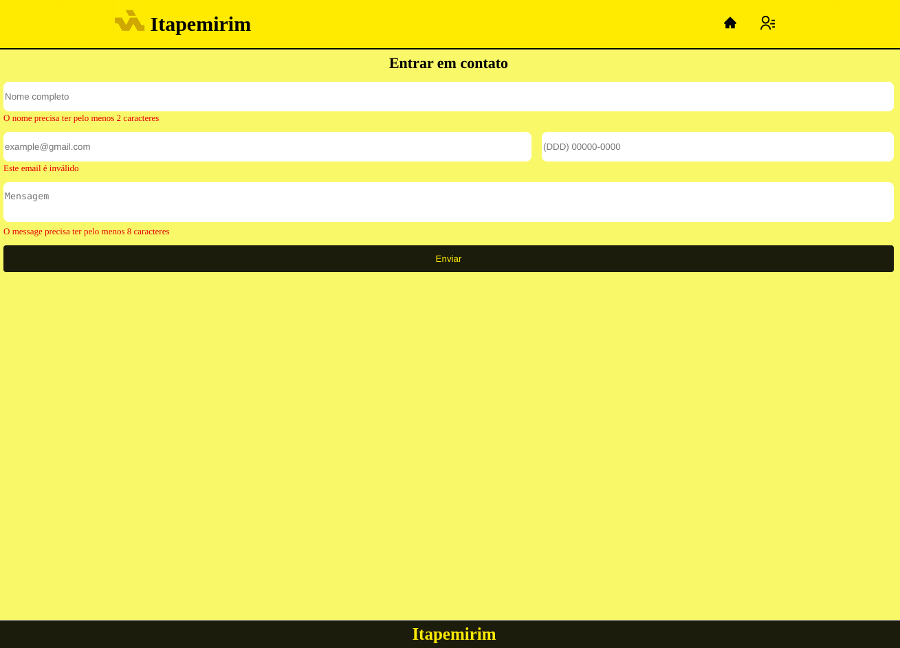
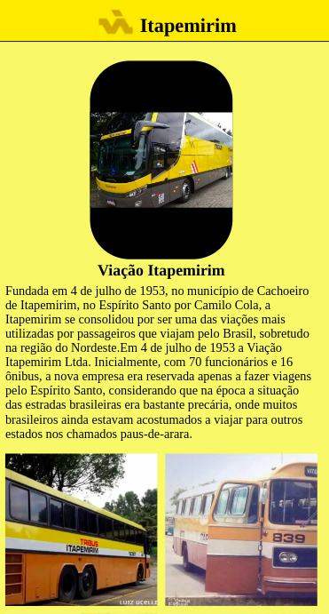
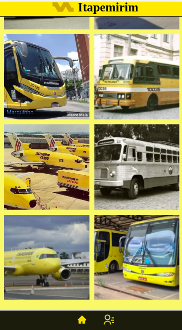
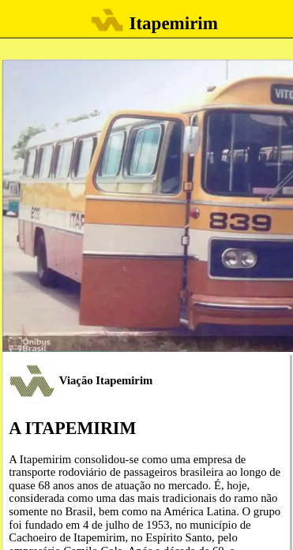
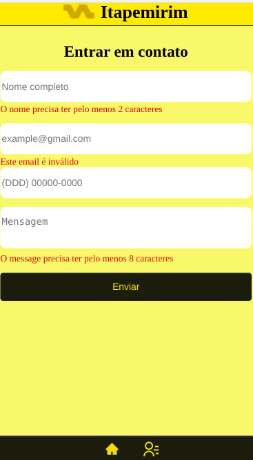

<p align="center">
  <a href="https://henriquemvss.github.io/blog_gatsby/" title="Viação Itapemirim Blog">
    
  </a>
</p>
<h1 align="center">
  Viação Itapemirim feito com Gatsby
</h1>

## 🚀 Quick start

1.  **Clone the repository**

    Use the npm.

    ```shell
    # install dependencies running this command
      npm install
    ```

2.  **Start developing.**

    Navigate into your new site’s directory and start it up.

    ```shell
    in the root of the project, open a terminal and run the command
    npm run start
    ```

3.  **Open the code and start customizing!**

    Your site is now running at http://localhost:8000
  

4.  **If you want to test the application follow the link:**

    Site is now running at https://henriquemvss.github.io/blog_gatsby/
        

5.  **Technologies used**

    - Gatsby

    - React

    - TypeScript

    - GraphQL

    - React-icons

    - Styled-jsx


## 🚀 Project screens
<p align="center">
    Fully responsive website with SEO practices developed in honor of Itapemirim, one of the largest companies in the road sector in the country. It shows images of iconic buses used by the company and by clicking on the photos of the buses it is possible to see a little of their history.
</p><br>
<p align="center">
   Desktop Version
</p>
<p align="center">
  
</p>

<p align="center">
  
</p>

<p align="center">
  
</p>

<p align="center">
  
</p><br>

<p align="center">
   Mobile Version
</p>

<p align="center">
  
</p>

<p align="center">
  
</p>

<p align="center">
  
</p>

<p align="center">
  
</p>

## 🚀 Final considerations

<p align="center">
    Project developed to improve my knowledge in the technologies mentioned above, learned during my specialization in fullstack development.
</p><br>